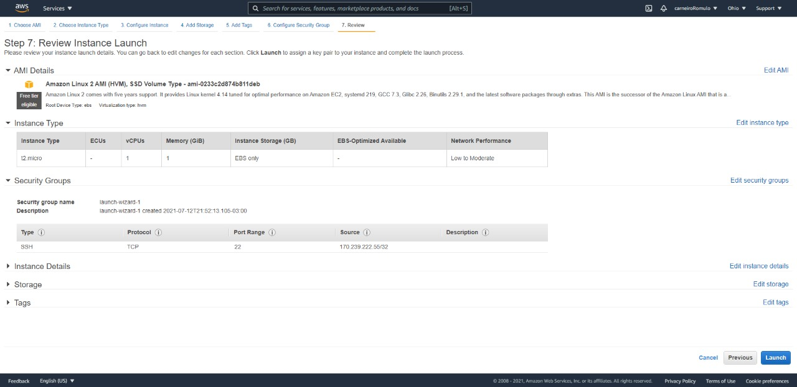

# Acessando AWS EC2 através da WSL

## Passo 01
Ao logar na AWS, clicar no menu superior esquerdo de Serviços e abrir o EC2

---

## Passo 02
Iniciar uma nova instância clicando no botão ``Launch Instance``

---

## Passo 03
Selecionar a ``AMI`` desejada

---

## Passo 04
Escolher o ``Tipo de Instância`` desejada

---

## Passo 05
Configurar os detalhes da instância

---

## Passo 06
Escolher os detalhes de armazenamento desejada

---

## Passo 07
Adicionar tags caso necessário

---

## Passo 08
Configurar o ``Grupo de Segurança``

---

## Passo 09
Checar se está tudo certo e clicar em ``Launch``

---

## Passo 10
Criar um novo ``Key Pair``, fazer seu download e armazená-lo em um local seguro, pois ela te dará acesso a instância, se for perdida não é possível acesar mais a instância. Feito isso, basta clicar em ``Launch Instances``

---

## Passo 11
Ao ser redirecionado para a página do Status, clicar em ``View Instances``

---

## Passo 12
Selecionar a instância criada clicando no ID da mesma

---

## Passo 13
Clicar em ``Connect`` e ir para para a aba ``SSH Client``

---

## Passo 14
Abrir o terminal do WSL no diretório em que se encontra o ``Key Pair`` e rodar os comandos indicados no [Passo 13](##-Passo-13)

