# Acessar AWS EC2 através da WSL e 

## Passo 01
Ao logar na AWS, clicar no menu superior esquerdo de Serviços e abrir o EC2

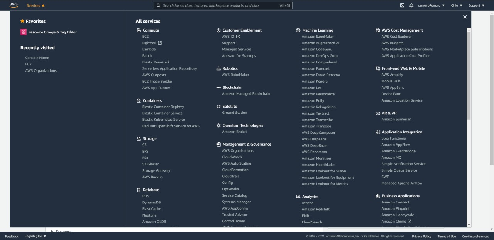

---

## Passo 02
Iniciar uma nova instância clicando no botão ``Launch Instance``

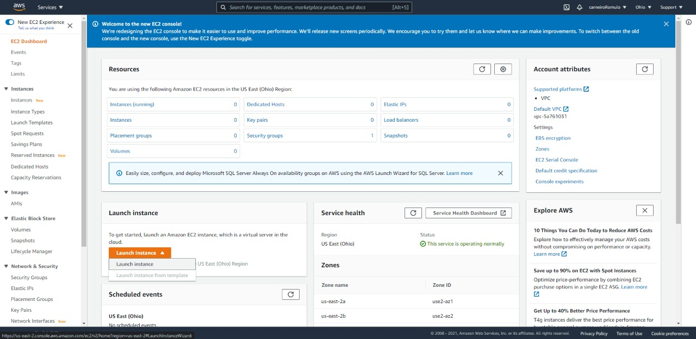

---

## Passo 03
Selecionar a ``AMI`` desejada

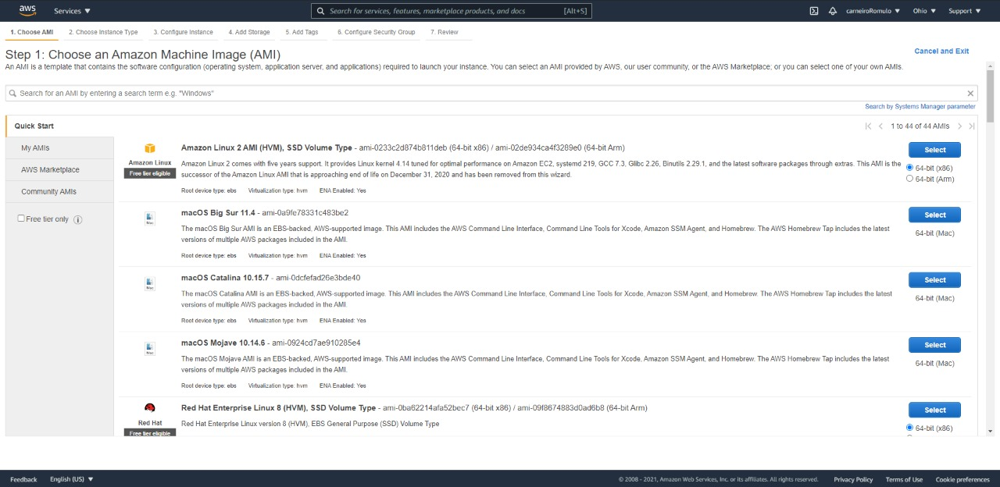

---

## Passo 04
Escolher o ``Tipo de Instância`` desejada

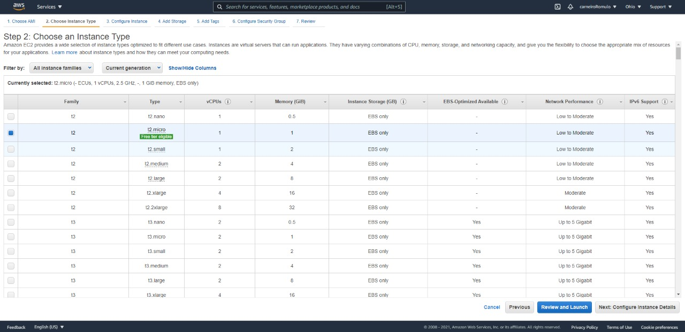

---

## Passo 05
Configurar os detalhes da instância

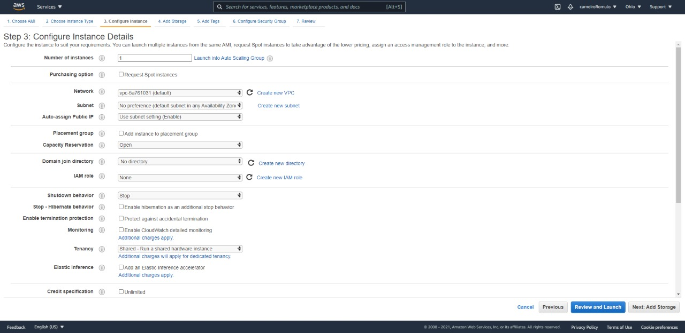

---

## Passo 06
Escolher os detalhes de armazenamento desejada

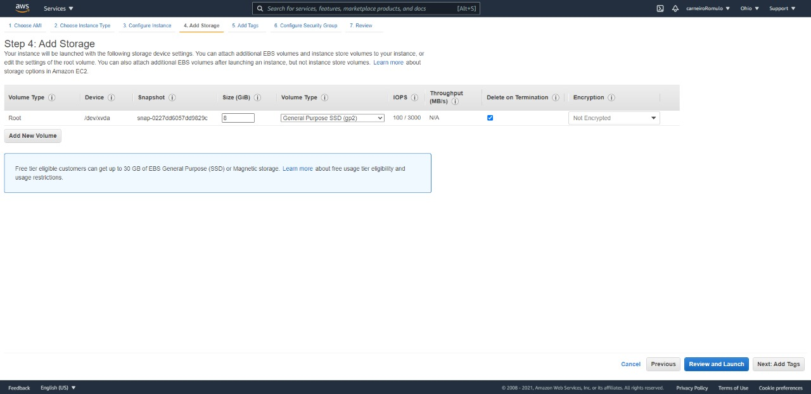

---

## Passo 07
Adicionar tags caso necessário

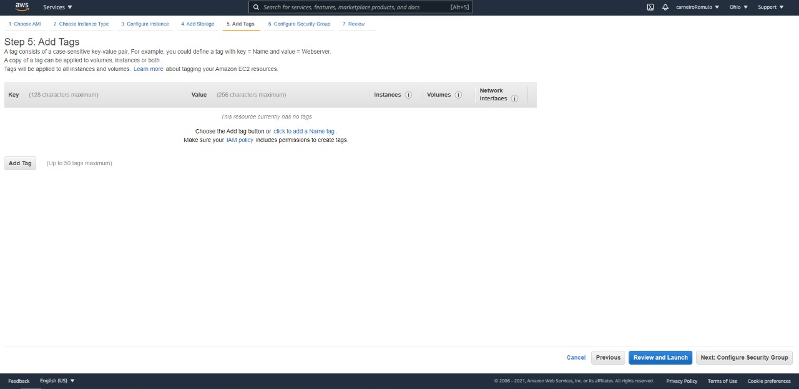

---

## Passo 08
Configurar o ``Grupo de Segurança``

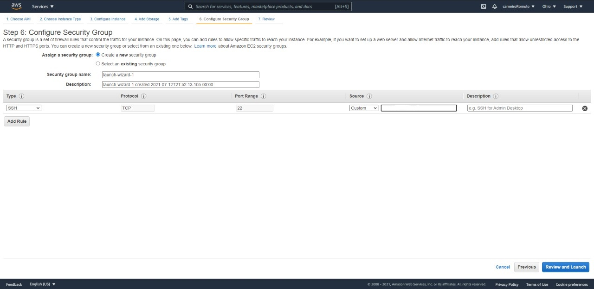

---

## Passo 09
Checar se está tudo certo e clicar em ``Launch``

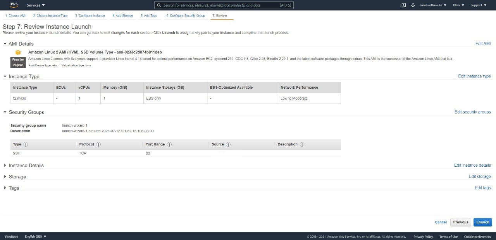

---

## Passo 10
Criar um novo ``Key Pair``, fazer seu download e armazená-lo em um local seguro, pois ela te dará acesso a instância, se for perdida não é possível acesar mais a instância. Feito isso, basta clicar em ``Launch Instances``

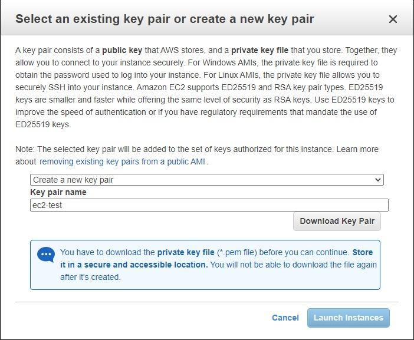

---

## Passo 11
Ao ser redirecionado para a página do Status, clicar em ``View Instances``

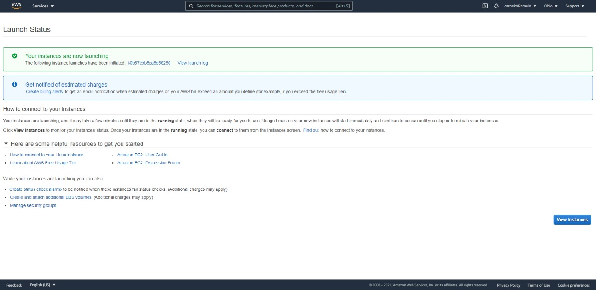

---

## Passo 12
Selecionar a instância criada clicando no ID da mesma

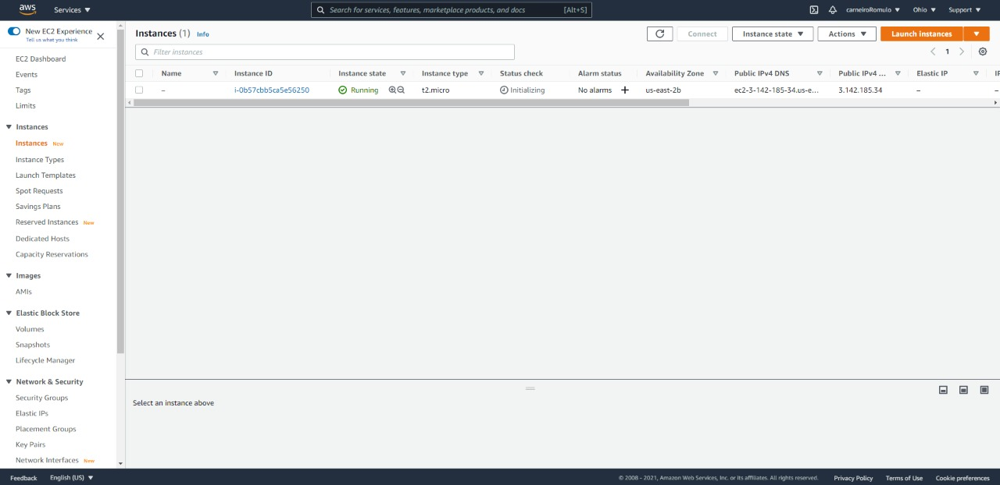

---

## Passo 13
Clicar em ``Connect`` e ir para para a aba ``SSH Client``

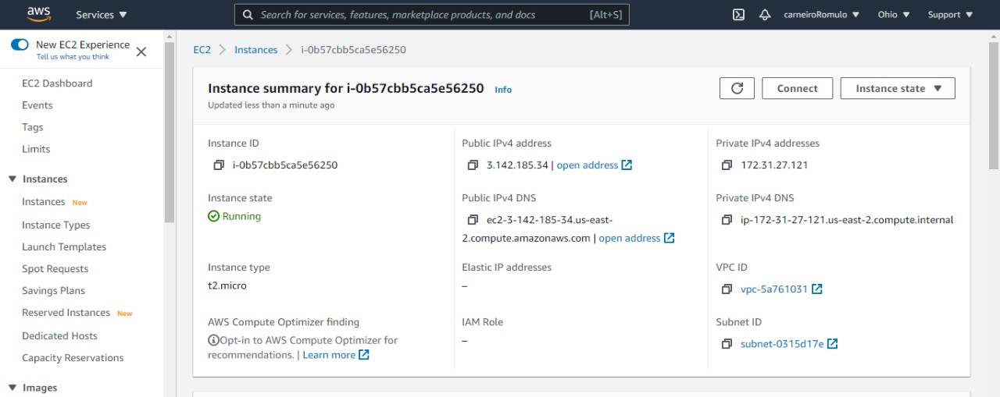
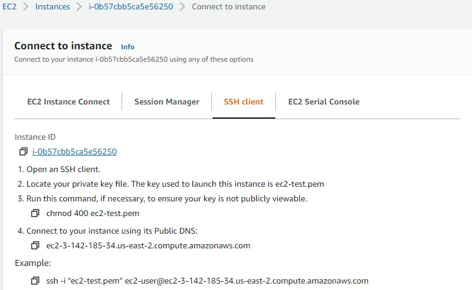

---

## Passo 14
Abrir o terminal do WSL no diretório em que se encontra o ``Key Pair`` e rodar os comandos indicados no ``Passo 13``. A partir daí estará dentro da intância na AWS

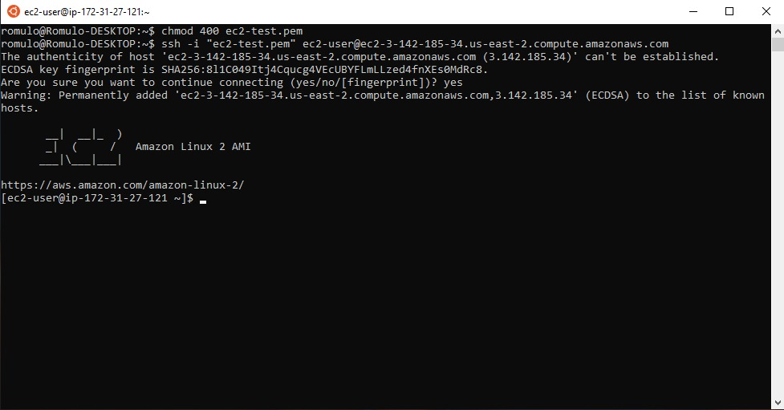

## Passo 15
Para rodar um script periodicamente pode-se usar comandos ``cron``. Com a implementação de um código python simples que gera um arquivo com a data atual, basta checar a localização do diretório atual e criar um arquivo ``.cron``.

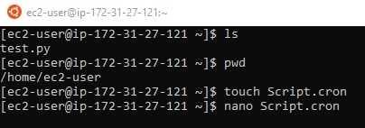

---

## Passo 16
Abrindo-o basta preenche-lo com o formato:

``min hour day(month) month day(week) python3 LocalDoArquivo``

Para fins de teste o código foi executado a cada minuto. Para formatar um crontab com alguma outra frequência o site [crontab guru](https://crontab.guru/#*_*_*_*) pode ajudar. 

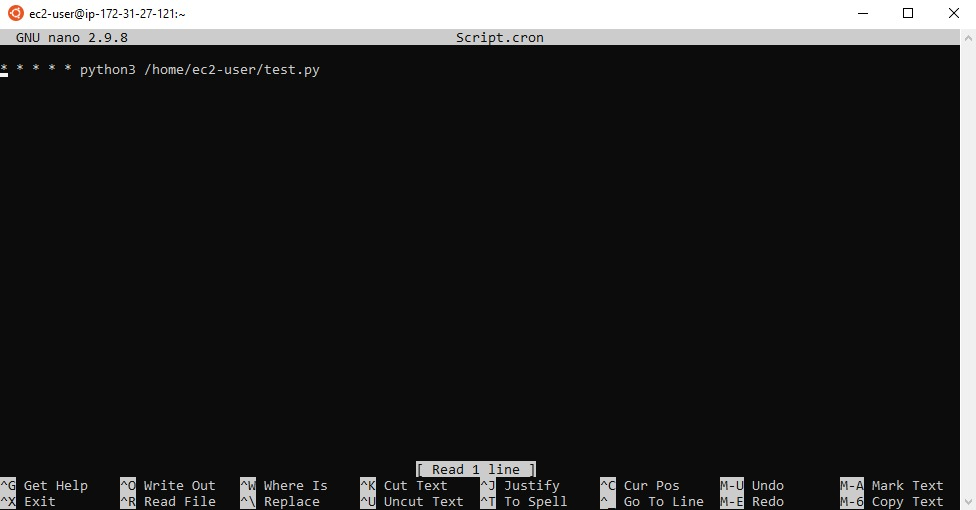

---

## Passo 17
Para que a tarefa cron funcione corretamente basta executar o arquivo cron e o código irá rodar periodicamente no tempo desejado.

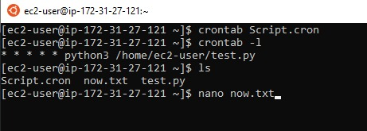
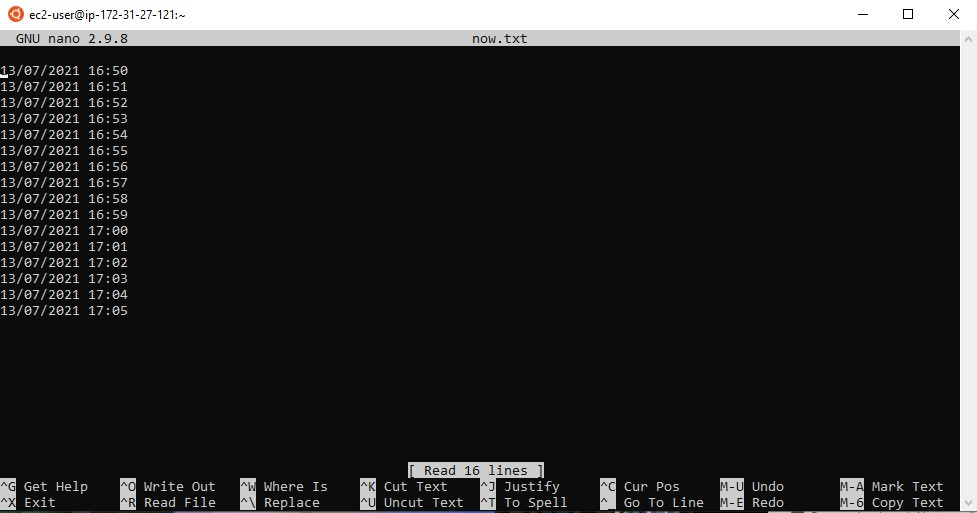
